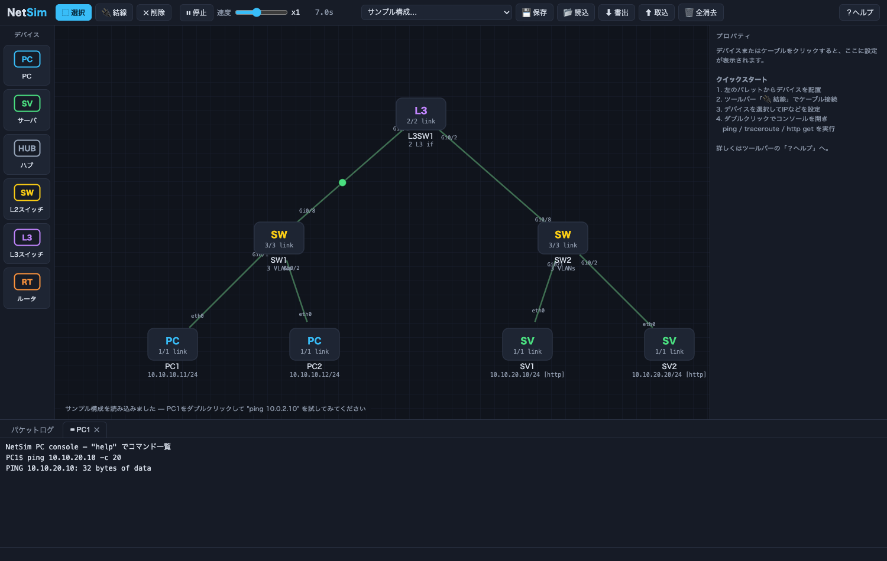
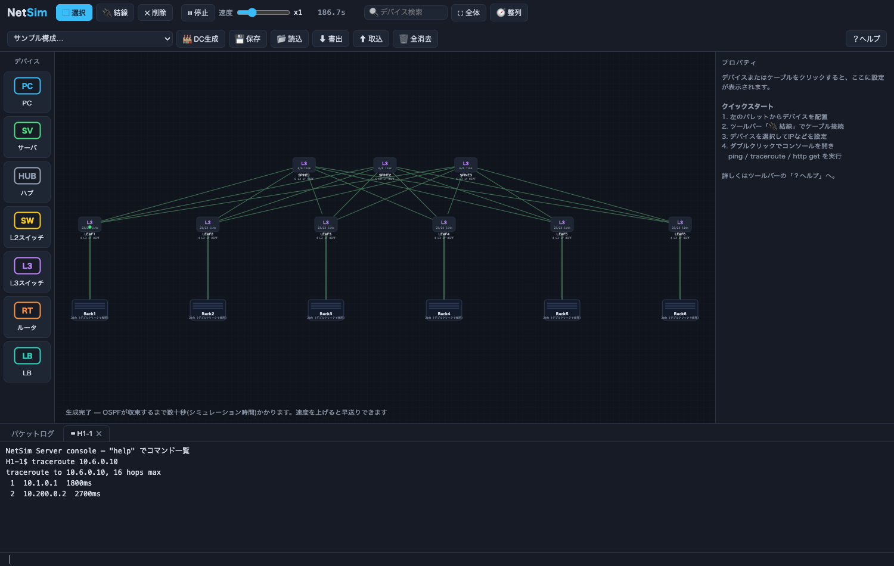

# NetSim — A Browser-Based L1–L4 Network Simulator

Build and configure networks in your browser as if you were assembling a data
center, and watch how packets flow across Layers 1 through 4. It runs as pure
HTML/CSS/JavaScript — no build step and no external dependencies.

It scales from small learning topologies all the way up to
**spine-leaf fabrics with hundreds of devices** (OSPF + ECMP, rack-based
grouping).




## Getting Started

```bash
open index.html          # Just open it in a browser — that's it
# or
python3 -m http.server   # → http://localhost:8000
```

## Features

| Layer | What's implemented |
|---|---|
| **L1 Physical** | Cabling, link up/down, `shutdown` / `no shutdown`, repeater hubs |
| **L2 Data Link** | Ethernet frames, MAC address learning & aging, flooding, 802.1Q VLANs (access/trunk/native VLAN), **STP (root/designated/alternate port selection)**, **static port channels (flow-hash distribution)**, loop safety guard |
| **L3 Network** | ARP, IPv4 routing (longest-prefix match + administrative distance), static routes, **OSPF-style dynamic routing (multi-area: Hello / area-scoped LSA flooding / ABR summaries / SPF)**, **ECMP (flow-hash distribution over equal-cost paths)**, TTL decrement, ICMP, inter-VLAN routing via SVIs, **VRRP (virtual IP / virtual MAC / preempt)**, **DHCP (client / server / `ip helper-address` relay)**, router-only **NAT/PAT (inside/outside interfaces, static NAT, interface overload = PAT, proxy-ARP for static publishing)**, **VXLAN (inner Ethernet over UDP/4789, static VTEP peers)** |
| **L4 Transport** | TCP (three-way handshake, FIN/RST), UDP, a simple HTTP server/client, extended ACLs, **L4 load balancer (round-robin + health checks)** |

### Devices

- **PC / Server** — Static IP or DHCP. Commands like `ping`, `traceroute`, `arp`, `http get`, `udp send`. Any host can become a DHCP server via the `dhcp pool` command
- **Hub** — Simple repeat-to-all-ports (L1)
- **L2 switch** — VLANs, MAC table, static `channel-group`
- **L3 switch** — L2 features + SVI + static/OSPF routing + ACLs + VRRP + VXLAN (NAT/PATなし)
- **Router** — Static/OSPF, ACLs, VRRP, DHCP relay, **NAT/PAT** (interfaces start in shutdown state on a new device)
- **LB** — L4 load balancer. TCP proxy to backends + health checks

### Basic Workflow

1. Place devices from the left palette (Shift+click to place several in a row)
2. Toolbar **"🔌 Connect"** → pick a device→port at each of two endpoints
3. Click to configure via the right panel (inspector); **double-click** for a console
4. Watch every frame in the **packet log** at the bottom (click a row for a per-layer decode)
5. Speed slider runs **x0.25–x64**. Fast-forward is handy for things like OSPF convergence

Shortcuts: `C` connect / `D` delete / `Esc` cancel / `Delete` delete / `Space` pause / `F` fit to screen

### Features for Large Topologies

- **🏭 DC Generator** — Auto-generates a fabric of spines (≤4) × leaves (≤8) × hosts (≤48/leaf).
  Each link gets a /30, OSPF + ECMP is pre-configured, and everything is grouped by rack
- **Groups (racks)** — Collapse into a single box; double-click to expand
- **Shift+drag** to multi-select → **bulk sequential IP assignment / bulk DHCP / bulk CLI command injection / grouping**
- **🔍 Search** (Enter for the next match), **⛶ Fit to screen**, **🧭 Auto-arrange** (hierarchical layout)
- The engine uses a binary heap + `structuredClone` + Canvas rendering, so
  **generating 200 hosts → OSPF convergence → pinging from all hosts at once completes in about 0.3s of real time**

## CLI (Cisco IOS-style)

Supports **abbreviations** (`sh ip int br`, `conf t`) and **`?` help**.

```
RT1> enable
RT1# configure terminal
RT1(config)# interface Gi0/0
RT1(config-if)# ip address 10.0.1.254 255.255.255.0
RT1(config-if)# no shutdown
RT1(config-if)# vrrp 1 ip 10.0.1.1          ← gateway redundancy (VRRP)
RT1(config-if)# vrrp 1 priority 120
RT1(config-if)# ip helper-address 10.0.2.9  ← DHCP relay
RT1(config-if)# exit
RT1(config)# router ospf 1                  ← dynamic routing
RT1(config-router)# network 10.0.0.0 0.255.255.255 area 0
RT1(config-router)# passive-interface Gi0/0
RT1(config-router)# end
RT1# show ip route          ← C/S/O routes (ECMP shows multiple "via" lines)
RT1# show ip ospf neighbor
RT1# show vrrp brief
RT1# shutdown all           ← bring down all interfaces (failure simulation)
RT1# no shutdown all        ← bring all interfaces back up
```

```
RT1(config)# interface Gi0/0
RT1(config-if)# ip nat inside                ← inside (private) interface
RT1(config-if)# interface Gi0/1
RT1(config-if)# ip nat outside               ← outside (global) interface
RT1(config-if)# exit
RT1(config)# access-list 100 permit ip 10.0.1.0 0.0.0.255 any
RT1(config)# ip nat inside source list 100 interface Gi0/1 overload   ← PAT (overload)
RT1(config)# ip nat inside source static 10.0.1.50 203.0.113.50       ← publish an internal server via static NAT
RT1# show ip nat translations   ← translation table (Pro / Inside global / Inside local / Outside global)
RT1# clear ip nat translation *
```

```
SW1(config)# interface Gi0/1
SW1(config-if)# channel-group 1 mode on       ← static bundle (two links into one logical link)
SW1(config-if)# switchport mode trunk
SW1# show etherchannel summary
SW1# show mac address-table                   ← the channel appears as Po1
SW1# show spanning-tree vlan 10               ← VLANごとのroot / designated / alternate状態
SW1(config)# spanning-tree mode rstp          ← 共通ツリーに切り替え (既定はRapid PVST+相当)
SW1(config)# spanning-tree vlan 1 priority 24576
```

### PC / Server / LB Commands

```
set ip 10.0.1.11 255.255.255.0 10.0.1.254   # static IP
set ip dhcp                                  # obtain automatically via DHCP
dhcp pool 10.0.1.0/24 10.0.1.100 10.0.1.199 10.0.1.1   # become a DHCP server
dhcp leases
ping / traceroute / arp -a / ipconfig
shutdown / no shutdown                        # NIC down / up
http get 10.0.2.5 / http server on|off
udp send <ip> <port> <msg> / udp listen <port>
lb service 80                                # LB only
lb backend add 10.0.2.10
lb status
vrrp 1 ip 10.0.2.100 / vrrp 1 priority 120  # redundancy for the LB's service VIP
show vrrp brief
```

## Sample Topologies (from the toolbar)

1. **Two segments via a router** — Basic observation of ping / ARP / TTL / TCP handshake
2. **VLAN + L3 switch (mini DC)** — Tagged frames on a trunk and SVI routing
3. **Redundant GW + LB + DHCP (VRRP)** — RT1/RT2 VRRP pair, DHCP relay, HTTP distribution via the LB.
   `shutdown` RT1's Gi0/0 to observe failover
4. **Spine-leaf (OSPF + ECMP)** — A small fabric. For larger topologies, use "🏭 DC Generator"
5. **NAT/PAT (internet sharing + static publishing)** — An internal LAN (10.0.1.0/24) shares a single
   global address via PAT to reach the external web. An internal server is published via static NAT (203.0.113.50).
   Observe the translations with `show ip nat translations`
6. **VXLAN tenant overlay (dual spine)** — Three VTEPs stretch tenant VLAN 10 (VNI 10100) over a routed
   OSPF underlay. From `CLIENT1`, run `ping 10.244.10.23` or `http get 10.244.10.23` and inspect the
   UDP/4789 encapsulation. Run `show vxlan` on a VTEP to see its local VNI/VLAN binding and static peers.

## Experiment Ideas

- In sample 4, run `traceroute` from several hosts → each flow takes a different spine (ECMP)
- `shutdown` one spine → OSPF reconverges and connectivity survives via the remaining paths
- In sample 3, take down RT1 → VRRP failover (you can also see the gratuitous ARP flow)
- In sample 6, capture a client-to-remote-app flow → the inner Ethernet frame is carried in VXLAN over UDP/4789
- `http server off` on an LB backend → the health check detects it as DOWN and removes it from distribution
- Connect two switches with two links → loop-detection warning → resolve it by bundling with `channel-group` (static port-channel)

## Tests

```bash
node tests/run.js       # core-engine tests (L1–L4 / OSPF / ECMP / DHCP / VRRP / VXLAN / LB / NAT / performance)
node tests/browser.js   # 28 UI tests on headless Chrome (requires: npm i puppeteer-core)
```

## Project Structure

```
index.html            entry point (no build required)
css/style.css
js/core/              simulation engine (DOM-free = testable under Node)
  util.js             MAC/IP, FNV hash, clone
  protocols.js        PDUs and decoders for Ethernet/ARP/IPv4/ICMP/TCP/UDP/OSPF/VRRP/DHCP
  sim.js              discrete-event scheduler (binary heap)
  link.js / device.js ports, cables, device base class
  stack.js            shared IP stack: ARP / ECMP routing / ICMP / UDP / TCP / VRRP / DHCP relay
  nat.js              NAT/PAT (static NAT, interface overload; routers only)
  ospf.js             OSPF-style routing (Hello / LSA / SPF / ECMP)
  acl.js / cli.js     extended ACLs, IOS-style CLI engine
  hub.js / switch.js / host.js / router.js / l3switch.js / lb.js
  topology.js         network model, groups, save/restore, samples, fabric generation
js/ui/                SVG canvas (+ Canvas packet rendering), inspector, terminal, packet log, toolbar
tests/                Node tests and browser tests
```

## Known Simplifications

- OSPF supports area IDs `0`–`4294967295`; non-backbone areas exchange routes through an ABR connected to area 0. There is no DR election, and SPF treats subnets as pseudo-nodes. Stub/NSSA areas, virtual links, route filtering, and LSA types other than the simulator's router/summary model are not implemented
- Port channels are static (`channel-group <n> mode on`); LACP negotiation/LACPDU is not implemented
- STP defaults to a Rapid PVST+ equivalent (one tree per VLAN); `spanning-tree mode rstp` selects a common tree. Both converge immediately after a topology change and omit BPDU timing, listening/learning timer states, and MSTP
- TCP is a simplified implementation with no retransmission or window control
- NAT is "inside source" direction only (static NAT + interface overload = PAT). Dynamic NAT pools, `outside source`, and per-port static NAT are not implemented
- IPv6 / BGP are not implemented
- Link latency is a uniform 450ms (simulation time) so you can follow packets by eye. The speed slider goes up to 64x
- `shutdown all` / `no shutdown all` are simulator-only convenience commands for fault injection, not IOS commands
