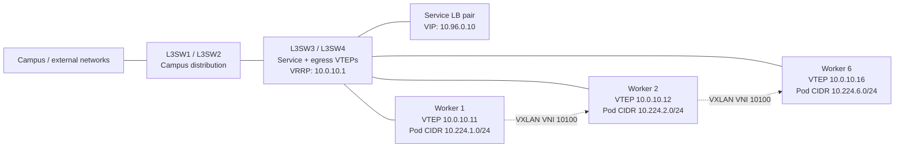

# VXLAN Kubernetes overlay topology

`demo-vxlan.json` keeps the existing campus, redundancy, and Kubernetes
lab topology without NAT. The Kubernetes Pod CIDRs are no longer advertised by OSPF.
Instead, every worker is a VXLAN tunnel endpoint (VTEP) on VLAN 151.

## Routing and encapsulation

- OSPF advertises only the `10.0.10.0/24` Kubernetes underlay. No device
  outside the cluster learns `10.224.0.0/16` or an individual Pod CIDR.
- Each worker has static VXLAN prefix-to-VTEP mappings for the Pod CIDRs owned
  by the other workers. An inner packet to a remote Pod is wrapped in an outer
  packet whose source and destination are the two VTEP addresses.
- `L3SW3` and `L3SW4` are also VTEPs. They can encapsulate Service LB traffic
  to a selected Pod without installing Pod routes in the campus core.
- Pod-to-Pod and Service-to-Pod traffic remains in the overlay. No worker is
  configured with NAT/PAT or a NAT ACL.
- As a result, this topology intentionally does not model Pod egress to
  networks that lack a route back to `10.224.0.0/16`. Model that boundary on a
  router or firewall when NAT is required.

## What this models and what it does not

This models a static VXLAN control plane without Node-local masquerade. In a
production Kubernetes installation, the CNI normally programs the prefix-to-
VTEP mappings and conntrack state automatically; EVPN, BGP, multicast, or a
control-plane database can distribute that information. This simulator uses
the saved topology configuration as that control plane.
