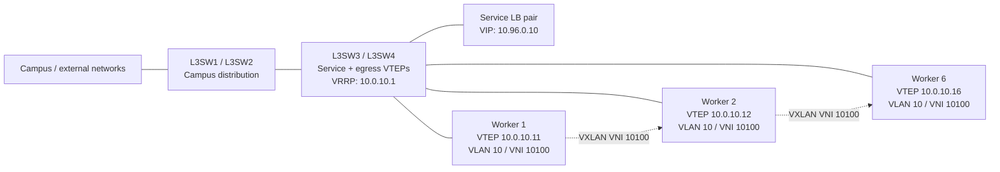

# VXLAN Kubernetes overlay topology

VXLAN は L3 Switch の VTEP 機能として、VNI にローカル VLAN を対応付けて利用する。
VTEP 間の underlay 到達性は通常の IP ルーティングで確保する。設定は以下の形式を
用いる。



## Routing and encapsulation

- VTEP は VLAN 10 の Ethernet フレームを VNI 10100 に対応付ける。
- outer packet は VTEP IP を送受信元とする UDP/4789。inner Ethernet の MAC は
  VTEP が学習し、未学習ユニキャスト・ブロードキャストは静的 peer 全台へ複製する。
- OSPF は underlay の VTEP 到達性だけを提供する。Pod CIDR の prefix-to-VTEP
  マッピングは使用しない。

```
L3SW(config)# vxlan vni 10100 vlan 10 source-interface Vlan151
L3SW(config)# vxlan peer 10.0.10.12
L3SW(config)# vxlan peer 10.0.10.13
```

## What this models and what it does not

This models a static VXLAN control plane without Node-local masquerade. In a
production Kubernetes installation, EVPN/BGP or a controller distributes MAC-
to-VTEP information; classic VXLAN can instead use multicast. This simulator
uses static ingress replication, while retaining the deployed VXLAN data-plane
encapsulation shape.
